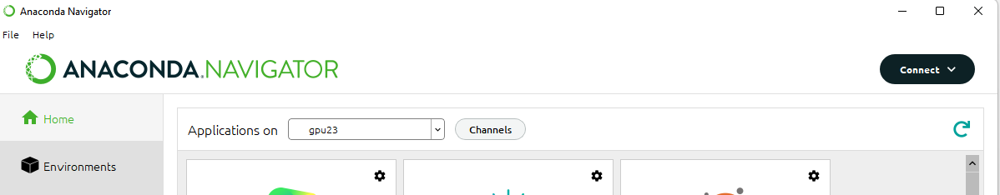

**This is an original guide written by by William Kaminski, Pedro Pacheco, and Juan Lopez.**

Note: This guide is directed to people who have an NVIDIA GPU compatible with CUDA, running Windows.

These are the steps we will be following:

1.  Install Anaconda
2.  Install CUDA
3.  Install cudnn
4.  Install Jupyter
5.  Install JAX
6.  Connect to Google Colab

&nbsp;  

## # 1\. Install Anaconda

First, we will install Anaconda, which is a distribution platform for data science. You can also install Jupyter on Python directly, but Anaconda makes our life easier by creating different environments and managing package installation for Python.

Download: [Anaconda | Anaconda Distribution](https://www.google.com/url?q=https://www.anaconda.com/products/distribution&sa=D&source=editors&ust=1650657645413676&usg=AOvVaw00nTLPXgvRoWG2NPaoAimE)

After we click the “Download” button on the website, we get a dialog telling us to install Anaconda Nucleus. You can ignore that:

&nbsp;  

&nbsp;  

The installation process is non-eventful except for a checkbox, enabled by default, which sets Anaconda as your default Python:

&nbsp;  

&nbsp;  

I left it enabled because I had not installed Python. Make sure it’s what you want before continuing.

We will use the Anaconda Navigator for the rest of the tutorial. It is just a GUI.

## 2\. Install CUDA

We will download CUDA from the website [CUDA Toolkit | NVIDIA Developer](https://www.google.com/url?q=https://developer.nvidia.com/cuda-toolkit&sa=D&source=editors&ust=1650657645416185&usg=AOvVaw2SloZyDkzg-CIVjBmyot_l). You can make sure your NVIDIA GPU is compatible by checking this list [CUDA GPUs | NVIDIA Developer](https://www.google.com/url?q=https://developer.nvidia.com/cuda-gpus&sa=D&source=editors&ust=1650657645416543&usg=AOvVaw3yTUe_LLP2_uuMP4EBHsBT).

Note: Write down the CUDA version you are installing; this will be useful when installing JAX.

## 3\. Install cuDNN

Download cuDNN from [NVIDIA cuDNN | NVIDIA Developer](https://www.google.com/url?q=https://developer.nvidia.com/cudnn&sa=D&source=editors&ust=1650657645417535&usg=AOvVaw21zshceJepSEqSH56cKlKH). You need to create a NVIDIA developer account to download the installer. You can activate a developer account on an existing NVIDIA account, or create a new one.

After agreeing to the terms of the cuDNN license agreement, download the ZIP file compatible with your CUDA version.

Note: Write down the version of cuDNN you’re installing; you’ll need it to install JAX.

The ZIP file has no executable; it is meant to be copied to your CUDA directory. Mine was at `C:\Program Files\NVIDIA GPU Computing Toolkit\CUDA\v11.6`

Extract the files into that directory, making sure the files in each subdirectory match the existing CUDA subdirectories, so files in `/bin/` go into `/bin/`, etc:

&nbsp;  

&nbsp;  

## 4\. Install Jupyter

We will open the Anaconda Navigator from the Start Menu. It may open about three command prompt windows when starting; that seems to be normal.

Anaconda has Jupyter preinstalled, but we will create a new conda environment, so we will need to install it again.

&nbsp;  

&nbsp;  

Open the CMD.exe Prompt. As you can see, we are inside a conda environment, specifically, the base one.

Then, follow [this guide](https://www.google.com/url?q=https://www.techentice.com/how-to-make-jupyter-notebook-to-run-on-gpu/&sa=D&source=editors&ust=1650657645420204&usg=AOvVaw17Em3IT0AyEJpfsV9TZ4_h), with the following caveat: when creating the conda environment, use your python version instead (You can check your python version by running `python --version`):

```python
conda create -n gpu2 python=3.9.7
```

Now, after we install the new environment and kernel, we close the CMD prompt.

We go back to Anaconda Navigator and select our newly created environment on the dropdown box:

&nbsp;  

&nbsp;  

The Jupyter tile now says “Install” instead of launch. We click on the button to install, and then launch Jupyter.

To test we have the GPU enabled, click on New on the upper right corner, and select your GPU profile:

&nbsp;  

&nbsp;  

Run this code in the notebook:

```python
import tensorflow as tf
if tf.test.gpu_device_name():
    print('Default GPU Device: {}'.format(tf.test.gpu_device_name()))
else:
    print("Please install GPU version of TF")
```

It should result in this:

&nbsp;  

&nbsp;  

## 5\. Install JAX

Before installing JAX, we need to install jaxlib. There is a guide for this on a [Reddit comment](https://www.google.com/url?q=https://www.reddit.com/r/learnmachinelearning/comments/qnqdy0/comment/hnzqtzu/?utm_source%3Dshare%26utm_medium%3Dweb2x%26context%3D3&sa=D&source=editors&ust=1650657645423796&usg=AOvVaw2F_3x-nq_11JfeilCDRsWZ) which I have condensed below:

“Go to [Jax Wheels](https://www.google.com/url?q=https://whls.blob.core.windows.net/unstable/index.html&sa=D&source=editors&ust=1650657645424644&usg=AOvVaw1ke638nXkByxarInmIDYBG) and download the version you want. This is where the "decoding" comes in. For example, look at this URL:

[https://whls.blob.core.windows.net/unstable/cpu/jaxlib-0.1.70-cp37-none-win\_amd64.whl](https://www.google.com/url?q=https://whls.blob.core.windows.net/unstable/cpu/jaxlib-0.1.70-cp37-none-win_amd64.whl&sa=D&source=editors&ust=1650657645425389&usg=AOvVaw3SYu7sbWT2VI-uEA90eVOo)

This wheel file– will install Jax 1.70 for Python 3.7 with no CUDA support. If you look at the URL's on the page, the number after "jaxlib" is the JAX version number, followed by "cpXX", where "XX" is the Python version number which must match the version of Python you are using. The URL's with "CUDA" are the wheel files for Jax with CUDA support, but the idea remains the same.”

Since there isn't an exact match, I chose `jaxlib-0.3.7+cuda11.cudnn82-cp39-none-win\_amd64.whl`.

Open the CMD prompt from Anaconda again if you have closed it, and use the command

`pip install {wheel file name}`

In order to install the wheel, make sure to pass the whole path to the file.

Now, to install JAX itself, run the command:

`pip install --upgrade "jax[cuda]"`

To test it, we run the following in a notebook:

```python
import jax
print(jax.default_backend())
print("Devices: ", jax.devices())
```

It should result in this:

&nbsp;  

&nbsp;  

## 6\. Connect to Google Colab

We need to install an extension created by Google in order to connect to our Jupyter server. To do so, run these commands in the CMD prompt on your gpu conda environment:

`pip install jupyter_http_over_ws`

`jupyter serverextension enable --py jupyter_http_over_ws`

Then, run Jupyter manually with the command:

`jupyter notebook --NotebookApp.allow_origin='https://colab.research.google.com' --port=8888 --NotebookApp.port_retries=0`

Note: if port 8888 is used, try the next one, and so on, until you manage to start Jupyter.

Once you run the command successfully, you will see something like this:


&nbsp;  
We will use that URL (localhost or 127.0…) in Colab.
&nbsp;  

Go to Colab, click on Connect, then Local runtime, and paste the URL.


&nbsp;  


&nbsp;  


Click Connect. Colab should work as usual. If you haven’t done so already, you will need to install matplotlib and other libraries in your gpu conda environment. You can do so on the CMD prompt or directly from colab, like this:

```python
!pip install matplotlib
```

Whatever you install will persist because it stays in your hard drive.

Note: You still have access to your local files. If you’re not sure where Colab is currently running, use the command

```python
!dir
```

To see what directory you’re in. It’s typically your `C:\users\[yourUser]` directory.

To work on Colab, place your data files in a suitable subdirectory and reference it in your code.
