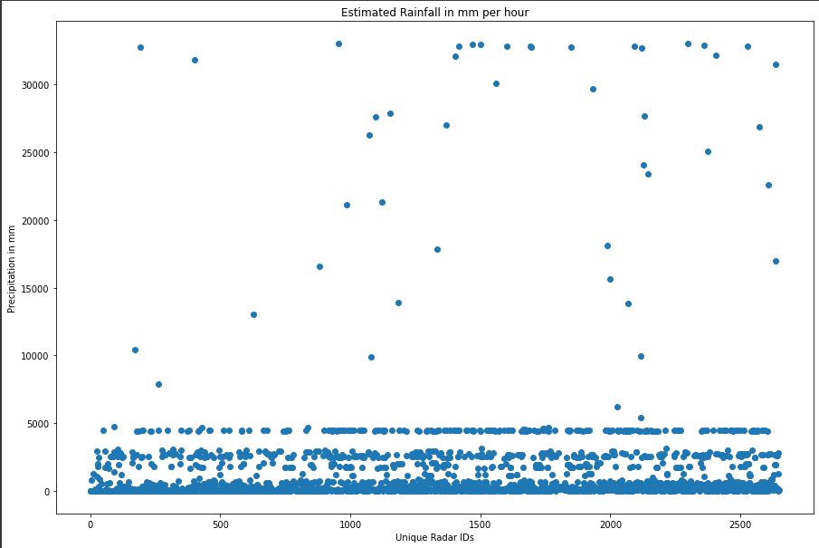
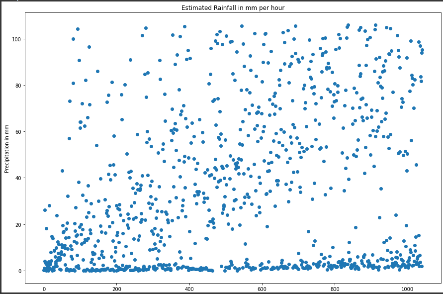
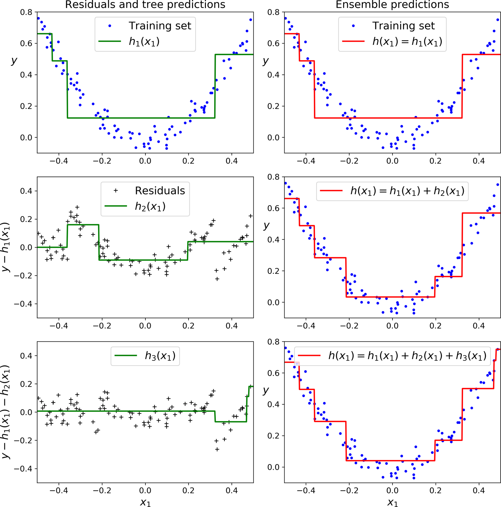
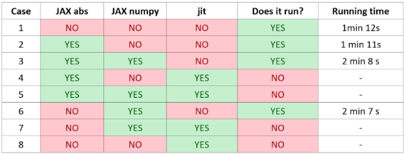

# Predicting Rainfall Using Gradient Boosting and Regression
## William Kaminski, Juan Lopez, Pedro Pacheco

See our code [here](Gradient_Boost_Rainfall_Prediction.ipynb).

## Abstract
Our team focused on tackling the plight farmers face of inaccurate precipitation predictions, which could cause economic and emotional hardship. By increasing the accuracy of hourly rainfall predictions, we can help improve the agricultural harvest of our users. By increasing the quality of harvest, revenue of farmers could improve. Our problem focuses on maximizing the accuracy of these predictions with polarimetric radar measurements provided by the Kaggle competition, How Much Did It Rain? II. By using the polarimetric radar measurements collected, our team was able to generate accurate weather predictions with pre-collected data using Gradient Boost. 

Our team intends to tackle this problem through training a random subset of a large training data set. Due to lack of computing capabilities in Colab, we used our CUDA enabled GPUs to compute our prediction. We designed a Gradient Boost algorithm to train our data. ID numbers in the data were grouped together to reduce the clutter. We found a threshold at 106mm that optimized our data. The data was converted into a scalar dataset which reduced errors. Gradient Boosting was used to accurately predict precipitation amounts. The mean square error was used as the loss function in the Gradient Boosting, while mean absolute error was used for model accuracy. Different hyperparameters were tested in order to find the optimized predictor. 

We implemented the Jax numpy library hoping to improve the speed of computation of our Gradient Boost model, but saw a decrease in some cases. For key points in our algorithm, such as computing the gradient, Jax improved our computation speeds. Our goal was to optimize the parameters of the algorithm to provide the best possible prediction. After testing a variety of learning rates and estimators, the optimized parameters were found. Using the mean squared error, a learning rate of 0.01 and increasing the number of regression tree estimators from 100 to 250 provided the best results. 

## Introduction
We are Weather Insight! Our team of experts has decided to take on the challenge of reducing the uncertainty that weather prediction creates. The competition on Kaggle, How Much Did It Rain? II, has provided the guidelines and data we used for our calculations that will be discussed later in the report. The data collected by Kaggle was collected as polarimetric radar measurements with gauges at varying distances. This data consists of measurements over an hour time span at different intervals. Polarimetric radars provide horizontal and vertical wave pulses, which makes it easier to read the size of the precipitation. Flatter rain drops indicate rain, while elongated raindrops indicate ice crystals. The evaluation metric is Mean Absolute Error.

With our goal to maximize the accuracy of rain prediction, we will be able to revolutionize the agricultural lifestyle in a positive way. If farmers are able to rely on accurate predictions, crop yields and quality of these crops will increase, thus increasing production and revenue. These predictions calculated by our learning algorithms will not only benefit farmers, but society as a whole. With the quality and variety of crops available, there will be ample resources, which in turn can reduce costs at the time of purchase. Our team will not only take away the unpredictability of a rainy day, but minimize inaccuracies farmers face that could lead to bad harvests, or even worse, another Dust Bowl. 

After creating a Gradient Descent learning model, the data provided was able to generate an accurate prediction of rainfall. The model used two hyperparameters, the learning rate and the number of estimators. These parameters affected the error and the variance of the prediction points compared to the expected data points. This error was evaluated with a Mean Absolute Error function our team implemented which uses jax.numpy arrays. It was found that the learning rate of 0.01 and 250 estimators was the most efficient hyperparameters to minimize this loss. In the experiments section, examples of different parameters used can be seen on a graph.

## Related Work
The following are sources we used to influence our ideology, approaches, and implementations. 

*Rainfall prediction using Extreme Gradient Boosting* (Anwar et al.). They used another variant of Gradient Boosting, specifically XGBoost, which we did not use in our work. They obtained a Mean Absolute Error of 8.8 mm.

*Estimating Rainfall From Weather Radar Readings Using Recurrent Neural Networks* (Sim).  This is an article written by Aaron Sim, who won the competition. He approached the data with minimal preprocessing (similar to ours) and no feature engineering, and downplayed the relevance of Mean Absolute Error. 

## Data
The data retrieved from the Kaggle competition, *How Much Did It Rain? II* was polarimetric radar measurements collected hourly from midwestern corn-growing states for 20 days between April and August 2014. This data was collected by NEXRAD, a network of weather radars operated by the National Weather Service, the FAA, and the U.S. Air Force. The measurements were stored using MADIS, a meteorological observation database and delivery system. The competition included a training dataset, test dataset, and a sample solution. The training data is tabular, with 24 columns and 13,765,201 entries. The test data is also tabular, containing 23 columns and 8,022,756 entries. 

A unique ID was given for the set of observations over an hour at a specific polarimetric radar. There were multiple observations within one hour, so this ID repeats multiple times throughout the table. The data is shuffled, so these IDs appear in random order. 21 out of 24 columns are observations specific to each radar such as radar reflectivity, radar distance, and other attributes found on the Kaggle competition page. These columns will later become our features for training. There is a final “Expected” column in the training dataset which corresponds to the gauges’ actual precipitation observation measured in mm. The testing dataset lacks this column which made us consider this expected value the ground truth observation that we would predict.

There was a variety of filtering that we needed to do in order to make the data as efficient and as accurate as possible when predicting the hourly rainfall. After importing the training data into Colab using Pandas, we grouped the data by the unique ID mentioned earlier. Since each ID corresponds to the rain measurements in an hour and there are multiple observations per hour, we took the average of all of the attributes for each ID and grouped them together this way. 

There were two main issues with the data that needed to be addressed. First, there were many NaN entries in our features. These entries were either not recorded or the observations were so small that they could be deemed insignificant. NaN is considered a null value, so in order to make the data usable we replaced all NaN entries with zeros. Now we were ready to finally plot the data for visual analysis.

Plotting the unique values, you can see the extreme outliers that were present in the provided dataset. These could have skewed our predictions drastically, so we needed to find a way to remove them. We took the mean of the expected values and found it to be approximately 108.626.  92% of the measurements were below 106mm, so we removed all values greater than 106. This created a much better correlated dataset than we had previously.

With preprocessing finished, we took a smaller partition of the training dataset to experiment with in order to save resources and time. The data was split into training labels and features as well as testing labels and features, all from the training set. These partitions will become important for our chosen method of prediction, Gradient Boost.
## Methods
After analyzing the data, we knew that we were dealing with a regression problem. Our goal was to predict the "expected" rainfall based on the given features and provide a predicted quantity. Given the large amount of features, the large dataset, and the very noisy expected values we knew something as simple as linear regression would not be feasible here. The dataset had 21 features so with such a large complexity we looked into methods involving decision trees and ensemble methods. Our method of choice for solving this problem ended up being Gradient Boosting.

Gradient Boosting is an ensemble method, or in other words, a series of “weak” learners that compute predictions which are combined to find one final prediction. There are a variety of ensemble methods including Random Forests, Gradient Boost, AdaBoost, etc.. Gradient Boosting is a method of boosting where a model is built and another model is trained based on the errors, or residuals of the previous model. Gradient Boost is different from other boosting methods as instead of adjusting weights for each new model, the new model is fit to the predecessor’s residuals. 

(Source: “Boosting — Introduction to Data Science.”)

The residuals are calculated using the derivative, or gradient of the mean-squared error. This gradient is calculated with respect to the previous prediction. The initial weight is the average of the sum of all of the observed measurements. From here, the first decision tree can be created by finding the errors of the observed measurement and this “predicted” measurement. The features of the data become nodes in the tree, and the leafs become these error values. The final prediction of the tree multiplied by the learning rate is added to the previous prediction until the number of trees (estimators) has been reached. This occurs for each measurement in the dataset until it is complete.

We felt that using this method was best for this situation for a few reasons. Gradient boosting is perfect for data with many features and rows. The large amount of features allows for more variety in the decision tree estimators. Our goal was to predict a single scalar value. Hence, Gradient Boost’s sequential method of learning from past estimators made it seem like a good choice for precision data such as the kind we were working with. Gradient boosting also benefits from flexibility as it can be adapted to a variety of loss functions. In this case, we used mean squared error as our loss function. We used a combination of Jax and Sci-Kit learn in our Gradient Boost algorithm. Jax was used for computing the mean squared error, the gradient, and the mean absolute error which we used to measure the accuracy of our model.  We used Sci-Kit-Learn to create regression trees and help compute our predictions. 

## Experiments
**JAX**

Our own mean absolute error function could incorporate JAX in three different ways: using the JAX absolute value function, JAX numpy arrays and jax.jit(). Since the alternative is not using those features, there are eight possible combinations. Not all of them were feasible as they caused both our own computers and Colab virtual machines to crash. 

These are the results:

**Hyperparameters**

When designing the model, our initial parameters were a learning rate of 0.1 and 100 total estimators. In order to further improve our prediction, we experimented with different hyperparameters. First, we reduced the learning rate to 0.001. This yielded extreme underfitting of the model. We think that making the learning rate so small and summing the residuals created extremely small prediction values. In order to circumvent this, we increased the number of estimators from 100 to 150 while keeping the learning rate of 0.001. This resulted in a better fit, but the performance of these parameters was still very poor compared to our initial results. We concluded that this learning rate was too small for this model, so we decided to increase the learning rate to 0.01 and also increase the number of estimators to 250. We found this model to fit the best so far. 

Next, we thought if we increased the number of estimators once again, we may have even better results. Therefore, we tried increasing the number of estimators to 400, but there was little to no improvement. Increasing the estimators proved to be more costly without improving the results. Considering all the observations, we determined the optimized hyperparameters: a learning rate of 0.01 and 250 estimators. 

## Conclusion

The use of JAX produced mixed results. In some cases, it optimized the running time. In others, it made it worse, or even made the computations fail completely altogether. However, it was very useful in the automatic calculation of gradients. Our predictor was able to predict the precipitation amount with a Mean Absolute Error of around 4.24 indicating our predictors were quite accurate. These numbers confirm the accuracy of our model and thus proves success in our mission of accurately predicting the precipitation amounts given the Kaggle data. Farmers can now rest assured knowing the weather for tomorrow, today.

## References
Anwar, M T, et al. “Rainfall Prediction Using Extreme Gradient Boosting.” *Journal of Physics: Conference Series*, vol. 1869, no. 1, 1 Apr. 2021, 10.1088/1742-6596/1869/1/012078.

Kunicki, Aleksander. “Rain_regression.” *Kaggle.com*, www.kaggle.com/code/aleksanderkunicki/rain-regression.

Monogioudis, Pantelis. “Boosting — Introduction to Data Science.” *Pantelis.github.io*, <https://pantelis.github.io/data-science/aiml-common/lectures/ensemble/boosting/_index.html>.

National Centers for Environmental Information. “Next Generation Weather Radar.” *National Centers for Environmental Information (NCEI)*, 22 Sept. 2020, www.ncei.noaa.gov/products/radar/next-generation-weather-radar.

National Oceanic and Atmospheric Administration. “NCEP Meteorological Assimilation Data Ingest System (MADIS).” *Madis.ncep.noaa.gov*, <https://madis.ncep.noaa.gov/>.

Sim, Aaron. “Estimating Rainfall from Weather Radar Readings Using Recurrent Neural Networks – Aaron Sim.” *Archive.org*, 21 Apr. 2016, <https://web.archive.org/web/20160421003010/simaaron.github.io/Estimating-rainfall-from-weather-radar-readings-using-recurrent-neural-networks/>.
